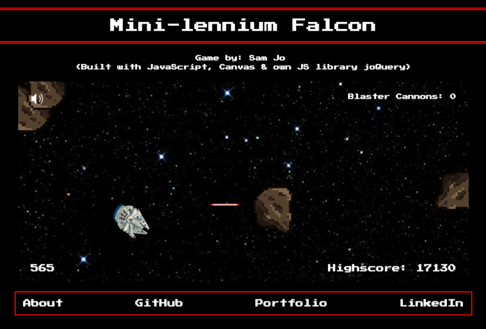

## Mini-lennium Falcon

[Play here](http://www.samueljo.com/Mini-lenniumFalcon/)



### Background

Mini-lennium Falcon is a spin off of the classic game Helicopter crossed over with the beloved, legendary starship the Millennium Falcon from the Star Wars series. It was written in JavaScript and uses Canvas for 2D rendering and own library joQuery for DOM manipulation.

### How to Play

Fly Han and Chewbacca through space but be careful to avoid hitting asteroids by hitting `SPACE`. Pick up powerups along the way to either stock up on blaster cannon ammunition or destroy all asteroids present on the screen. Hit `ENTER` to shoot and `S` to toggle sound.

### Features

#### 2D Rendering & Sprite-ing
All 2D rendering is done using HTML 5 Canvas. By overlaying sprite images over 'pseudo Canvas elements', I was able to detect all collisions between `Ship` and `Asteroid`, `Ship` and `PowerUp`, and `Blaster` and `Asteroid`.

```javascript
draw(ctx) {
  const image = Sprite.createImage(this.path);
  const imgOffsetX = this.pos[0] - this.xDim / 2;
  const imgOffsetY = this.imgOffsetY || this.pos[1] - this.yDim / 2;

  ctx.drawImage(image, imgOffsetX, imgOffsetY, this.xDim, this.yDim);
}
```

#### Points
A high score is stored in local storage and over-written if there is no existing high score or if the new score is greater than the existing one.

Both the points and high score (along with the modals, blaster cannon count, and sound icons) are manipulated using my own, light-weight DOM manipulation library, joQuery.

```javascript
let isNewHighScore = (this.game.points > localStorage.getItem('highScore'));
if (!localStorage.getItem('highScore') || isNewHighScore) {
  localStorage.setItem('highScore', this.game.points);
}
$jo('.highscore').text(`Highscore: ${localStorage.getItem('highScore')}`);
```

#### Audio
All audio playing is done using JavaScript's HTMLAudioElement API.

I implemented an event listener using joQuery to toggle muting for all Audio elements in the document.

```javascript
renderSound(isMuted) {
  if (isMuted) {
    $jo('.sound').addClass('muted');
  } else {
    $jo('.sound').removeClass('muted');
  }
}
```
